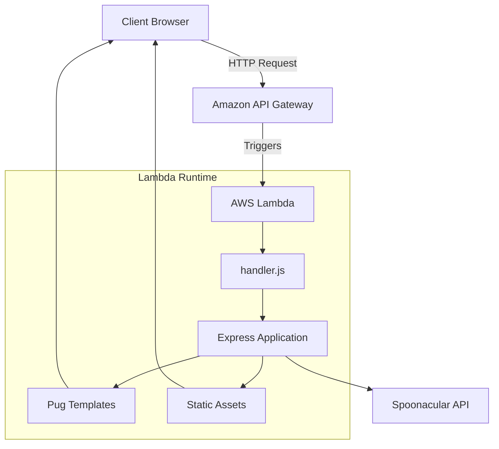

# Hi food lovers 👋


# 🍽️ Foodmania: An Immersive Culinary Experience

Have you ever wondered what ingredients to use or how long it takes to cook certain dishes? My wife certainly has, so I decided to build **Foodmania**—a web application that helps users discover recipes, cooking techniques, ingredients, and fascinating food facts in one place.

---

# 🚀 Live Demo

The application is deployed entirely using a **fully serverless architecture**.

🔗 **Live Application:**  
https://akn9xyam4d.execute-api.us-east-1.amazonaws.com/dev/

---

# 📖 Project Overview

Foodmania showcases modern backend engineering and cloud architecture through:

- **Serverless Architecture** — Event-driven execution powered by AWS Lambda and Amazon API Gateway.
- **REST API Integration** — Fast recipe retrieval using the Spoonacular API.
- **Server-Side Rendering (SSR)** — Dynamic HTML rendering with Pug templates.
- **Infrastructure as Code (IaC)** — Fully managed using Serverless Framework v4.
- **Express.js Routing** — Modular Express application adapted for Lambda execution.
- **Environment Configuration** — Secure secret management with dotenv and AWS environment variables.

The platform allows users to search recipes, discover cooking techniques, and learn culinary facts through a centralized, scalable web application.

---

# ✨ Usage

The application is divided into three primary sections.

## 1. Recipe Search

The landing page is where everything begins.

Simply type the name of a dish or ingredient, click the **Yummy** button, and Foodmania retrieves matching recipes along with detailed information.

---

## 2. Food Facts

Learn surprising facts about foods from around the world.

Randomized culinary trivia keeps the experience educational and entertaining.

---

## 3. Cooking Techniques

Master useful cooking methods and best practices shared by experienced chefs and home cooks.

Learning proven techniques saves time and improves cooking results.

---

# 🏗️ System Architecture

Foodmania has been migrated from a traditional stateful Express server into a fully serverless, event-driven architecture.



---

# 📁 Repository Structure

```text
food/
├── public/                 # Static assets (CSS, JavaScript, Images)
├── views/                  # Pug templates
├── app.js                  # Express application
├── handler.js              # Lambda entry point (@vendia/serverless-express)
├── package.json            # Dependencies & scripts
└── infra/
    └── serverless.yml      # Infrastructure as Code
```

---

# ✨ Features

## 🍕 Recipe Discovery

- Search recipes by keyword
- Browse recipe details
- View ingredients
- Read preparation instructions
- Cooking time information
- Nutritional data

---

## 👨‍🍳 Cooking Techniques

- Learn professional cooking methods
- Discover preparation best practices
- Improve culinary knowledge

---

## 🥗 Food Facts

- Random food trivia
- Educational culinary content
- Dynamic fact generation

---

# 💻 Technology Stack

| Layer | Technologies |
|--------|--------------|
| **Frontend** | HTML5, CSS3, JavaScript (ES6+) |
| **Template Engine** | Pug |
| **Backend** | Node.js, Express.js |
| **Cloud** | AWS Lambda, API Gateway, CloudWatch |
| **Deployment** | Serverless Framework v4 |
| **Configuration** | dotenv-cli |
| **External API** | Spoonacular API |
| **Version Control** | Git & GitHub |

---

# 🎯 Skills Demonstrated

### ☁️ Cloud Architecture & DevOps

- Migration of a traditional Express application into a cloud-native serverless solution.
- AWS Lambda event-driven execution.
- Zero-cost deployment under the AWS Free Tier.
- Infrastructure as Code using Serverless Framework.

---

### ⚙️ Backend Engineering

- Modular Express routing.
- Reusable middleware.
- Framework-agnostic application structure.
- REST API consumption.
- Server-side rendering with Pug.

---

### 🚀 Serverless Asset Management

- Binary media type configuration in API Gateway.
- Static asset delivery from Lambda packages.
- Base64 streaming support.
- Optimized cold-start behavior.

---

### 🔒 Secure Environment Management

- Runtime environment variable injection.
- API key isolation.
- dotenv integration.
- Secrets excluded from version control.

---

# 📚 What You'll Learn

This project demonstrates practical knowledge of:

- Serverless Computing
- AWS Lambda
- Amazon API Gateway
- Express.js
- Node.js
- REST API Integration
- Infrastructure as Code
- Cloud Deployment
- Server-Side Rendering
- Pug Templates
- Environment Configuration
- Modern Backend Development

---

# 📄 License

This project is intended for educational purposes and serves as a demonstration of modern serverless web application architecture.

