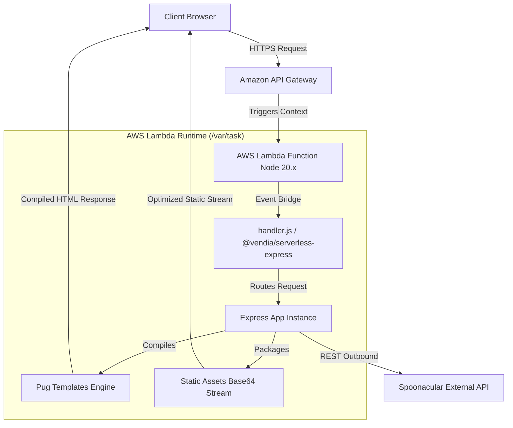

# Hi food lovers 👋


# 🍽️ Foodmania: An Immersive Culinary Experience

Have you ever wondered what ingredients to use or how long it takes to cook certain dishes? My wife certainly has, so I decided to build **Foodmania**—a production-grade serverless web application that helps users discover recipes, cooking techniques, ingredients, and fascinating food facts in one place.

---

# 🚀 Live Demo

The application is deployed entirely using an enterprise-ready, **fully serverless architecture** operating at 100%

🔗 **Live Application URL:** [https://akn9xyam4d.execute-api.us-east-1.amazonaws.com/dev/](https://akn9xyam4d.execute-api.us-east-1.amazonaws.com/dev/)

---

# 📖 Project Overview

Foodmania showcases modern cloud engineering, secure DevOps automation, and scalable backend practices through:

* **Serverless Paradigm:** Event-driven computing powered by AWS Lambda and Amazon API Gateway to achieve zero-cost idle times and instant scaling.
* **GitOps CI/CD Automation:** Fully automated testing and deployment pipeline using GitHub Actions, utilizing short-lived cryptographic tokens via **AWS IAM OIDC Federation** (eliminating the need for permanent AWS Access Keys).
* **Infrastructure as Code (IaC):** Complete infrastructure provisioning, asset streaming, and environment hooks defined declaratively via **Serverless Framework v4**.
* **State & Configuration Orchestration:** Centralized backend tracking utilizing **AWS Systems Manager (SSM) Parameter Store** to handle global state mapping seamlessly across continuous deployments.
* **Dynamic Server-Side Rendering (SSR):** Ephemeral HTML compilation using Node.js 20.x, Express.js custom middleware, and Pug templating engines.

---

# ✨ Usage

The application decouples its business capabilities into three functional culinary modules:

### 1. Recipe Search
The main web view connects to the Spoonacular REST API. Users input any target dish or ingredient payload, and the backend orchestrates data validation to output structured, clean metadata cards.

### 2. Meal Planner
A planning interface that assembles chosen recipes into a weekly menu, generates ingredient checklists, and previews meal schedules.

### 3. Wine Pairing
Renders the wine-pairing to display recommendations on wines for dishes, tasting notes, pairing rationale, and serving suggestions.

---

# 🏗️ Cloud & Deployment Architectures

### Runtime Infrastructure Architecture
The system has been completely decoupled from traditional stateful server constraints into an ephemeral serverless runtime. Static files (CSS/JS) and media configurations are packaged and streamed over base64 protocols through AWS API Gateway directly from the Lambda package.



```markdown
food/
├── public/                 # Static assets (CSS, client-side JS, layout assets)
├── views/                  # Pug presentation tier layouts
├── app.js                  # Pure, framework-agnostic Express routing configurations
├── handler.js              # Ephemeral adapter layer for AWS Lambda interface execution
├── package.json            # Global production and development dependencies metadata
└── infra/                  # Dedicated infrastructure automation module
    └── serverless.yml      # Declarative Infrastructure as Code blueprint (Serverless v4)
```

# ✨ Core Features

### 🍕 Recipe Engine
* Asynchronous search filtering via query parameter tracking.
* Comprehensive component rendering: ingredient weights, precise cook times, preparation walkthrough steps, and exact macro-nutritional calculations.

### 👨‍🍳 Cooking Library
* Structural layout grids showcasing curated culinary blueprints.
* Performance optimized asset delivery to minimize cold-starts on multi-route requests.

### 🥗 Culinary Trivia
* Data payload processing returning isolated, readable facts on every lifecycle request.

### 📅 Menu Planning
* Interactive weekly meal schedule builder with drag-and-drop recipe assignments.
* Automated ingredient aggregation and shopping list generation across selected meals.
* Nutritional breakdown summaries and dietary preference filtering.

---

# 💻 Enterprise Technology Stack

| Layer | Component | Description |
| :--- | :--- | :--- |
| **Frontend** | HTML5, CSS3, JS (ES6+) | Modern, lightweight document layout structures. |
| **Template Engine** | Pug | High performance HTML shorthand syntax compiler. |
| **Application Runtime**| Node.js 20.x / Express.js | Microservice backend container baseline. |
| **Cloud Computing** | AWS Lambda | Ephemeral computing platform for zero-maintenance scaling. |
| **API Proxy** | Amazon API Gateway | Public proxy interface mapping routes to Serverless handlers. |
| **Telemetry** | AWS CloudWatch Logs | Real-time diagnostics, system trace tracking, and monitoring. |
| **State Orchestration**| AWS SSM Parameter Store | Configuration state repository for global S3 deployment mappings. |
| **CI/CD / IaC** | Serverless v4 & GitHub Actions | Infrastructure as Code provisioning paired with an OIDC pipeline. |

---

# 🎯 DevOps & Software Engineering Mastery

### Cloud Automation & GitOps
* **Secure Cloud Handshakes:** Complete mitigation of permanent access key risk profiles through OpenID Connect integrations with IAM trusted policies.
* **Dependency Cache Mapping:** Optimizing GitHub runner execution loops via `actions/cache@v4` routines attached to lockfile hashes, reducing overall delivery overhead.
* **State Externalization:** Leveraging automated platform locks via AWS SSM to securely abstract artifact locations.

### Production Backend Engineering
* **Serverless Express Wrappers:** Translating REST requests effortlessly into standard Lambda execution payloads using `@vendia/serverless-express`.
* **Robust Configuration Encapsulation:** Strict environment variables sanitization using robust `dotenv-cli` injectors, blocking local keys from leaking into target codebases.

---

# 📄 License

This project is created exclusively for educational purposes and architectural validation runs, serving as an open-source demonstration of lean, modern serverless development.