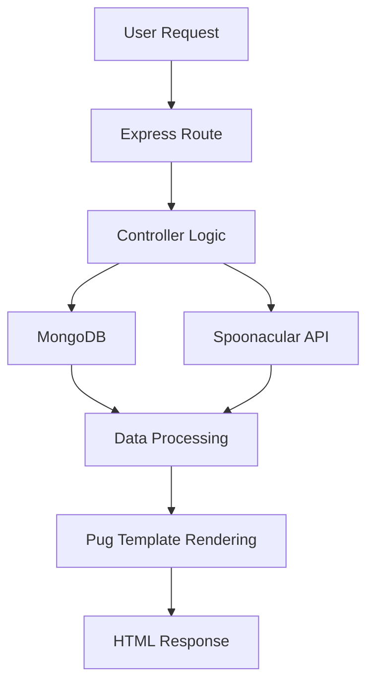

# Hi food lovers 👋

## Foodmania: An Immersive Culinary Experience

Have you ever wondered what ingredients to use or how long it takes to cook certain dishes? My wife has, so I decided to create a website to showcase exactly that along with cooking techniques and more.

## Project Overview

FoodMania demonstrates modern backend development practices through:

REST API integration with Spoonacular
Dynamic server-side rendering using Pug
MongoDB data persistence with Mongoose
Express.js routing and middleware
Environment-based configuration management
CI/CD automation with GitHub Actions

The platform allows users to search for recipes, discover cooking techniques, and explore culinary information through a centralized web application.

## Usage

This project is divided into 3 sections as described below:

1. **Index**   
   The main/index page is where all the magic happens. As soon as you type the dish or keyword you want information for and click on the Yummy button, you will see the recipes shown.

2. **Food Facts**   
   Here, your mind will be blown away by some interesting food facts you probably didn't know or haven't heard about before.

3. **Cooking Techniques**   
   There's nothing that saves more time than the know-how or techniques passed along by other people in our society. Why reinvent the wheel if somebody else has already come up with that knowledge?

## 🏗️ System Architecture

┌─────────────────┐
│     Browser     │
│   User Client   │
└────────┬────────┘
         │ HTTP Request
         ▼
┌─────────────────┐
│   Express.js    │
│ Application API │
└────────┬────────┘
         │
         ├───────────────────────┐
         │                       │
         ▼                       ▼
┌─────────────────┐     ┌─────────────────┐
│    MongoDB      │     │  Spoonacular    │
│ Application DB  │     │   External API  │
└─────────────────┘     └─────────────────┘
         │                       │
         └───────────┬───────────┘
                     ▼
          ┌─────────────────┐
          │  Pug Templates  │
          │ Server Rendering│
          └────────┬────────┘
                   ▼
          ┌─────────────────┐
          │ HTML Response   │
          └─────────────────┘

graph LR

Client[Client Browser]

Express[Express Server]

Views[Pug Views]

Mongo[(MongoDB)]

API[Spoonacular API]

Client --> Express

Express --> Mongo

Express --> API

Express --> Views

Views --> Client

## ✨ Features
Recipe Discovery
Search recipes by keyword
Retrieve detailed recipe information
Display ingredients and preparation instructions
Access cooking duration and nutritional data
Cooking Techniques
Explore culinary methods
Learn food preparation best practices
Improve cooking knowledge
Food Facts
Dynamic food trivia
Educational culinary content
Randomized fact generation

## Technologies

| Layer             | Technologies          |
| ----------------- | --------------------- |
| Frontend          | HTML, CSS, JavaScript |
| Rendering         | Pug                   |
| Backend           | Node.js, Express.js   |
| Database          | MongoDB               |
| ODM               | Mongoose              |
| External Services | Spoonacular API       |
| CI/CD             | GitHub Actions        |
| Version Control   | Git                   |

## 🎯 Skills Demonstrated
Backend Development
RESTful API Consumption
Database Modeling
Express Middleware
Server-Side Rendering
CI/CD Pipelines
Environment Configuration
Full-Stack JavaScript
Software Architecture
MVC Design Patterns
