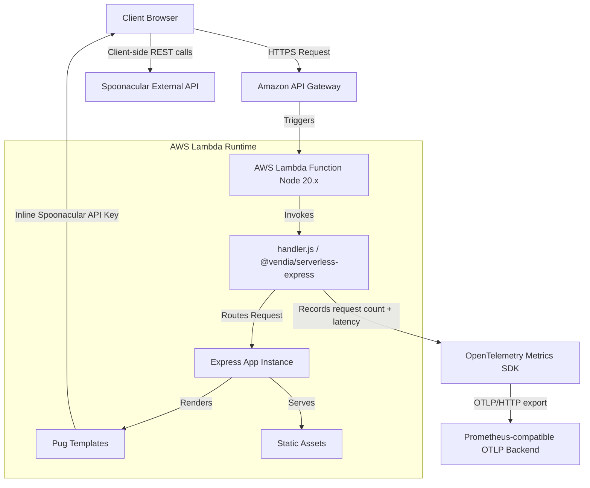
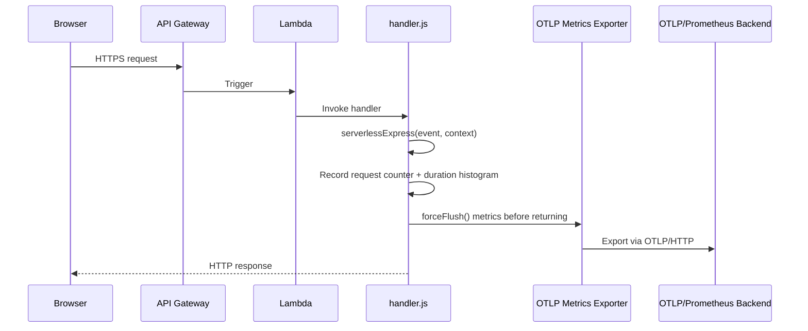
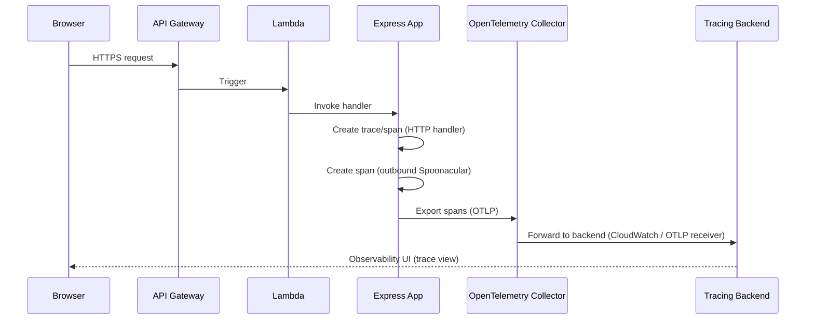
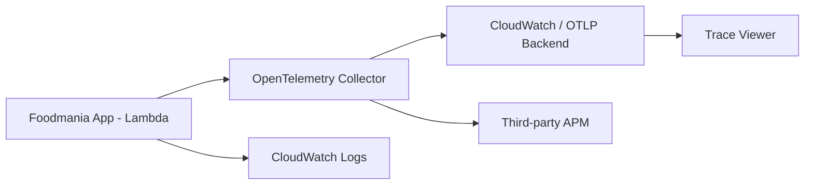

# Hi food lovers 👋


# 🍽️ Foodmania: An Immersive Culinary Experience

Have you ever wondered what ingredients to use or how long it takes to cook certain dishes? My wife certainly has, so I decided to build **Foodmania**—a production-grade serverless web application that helps users discover recipes, cooking techniques, ingredients, and fascinating food facts in one place.

---

# 🚀 Live Demo

The application is deployed entirely using an enterprise-ready, **fully serverless architecture** operating at 100%

🔗 **Live Application URL:** [DEMO](https://akn9xyam4d.execute-api.us-east-1.amazonaws.com/dev/)

---

# 📖 Project Overview

Foodmania showcases modern cloud engineering, secure DevOps automation, and scalable backend practices through:

* **Serverless Paradigm:** Event-driven computing powered by AWS Lambda and Amazon API Gateway to achieve zero-cost idle times and instant scaling.
* **GitOps CI/CD Automation:** Fully automated testing and deployment pipeline using GitHub Actions, utilizing short-lived cryptographic tokens via **AWS IAM OIDC Federation** (eliminating the need for permanent AWS Access Keys).
* **Infrastructure as Code (IaC):** Complete infrastructure provisioning, asset streaming, and environment hooks defined declaratively via **Serverless Framework v4**.
* **State & Configuration Orchestration:** Centralized backend tracking utilizing **AWS Systems Manager (SSM) Parameter Store** to handle global state mapping seamlessly across continuous deployments.
* **Dynamic Server-Side Rendering (SSR):** Ephemeral HTML compilation using Node.js 20.x, Express.js custom middleware, and Pug templating engines.

---

#  Usage

The application currently exposes six server-rendered routes, each backed by its own Pug view:

| Route | View | Purpose |
| :--- | :--- | :--- |
| `GET /` | `index.pug` | Home page / recipe search, powered by the Spoonacular API |
| `GET /random` | `randomrecipe.pug` | Surfaces a random recipe suggestion |
| `GET /menu` | `menu.pug` | Browsable recipe/menu grid |
| `GET /planner` | `plan.pug` | Meal-planning view |
| `GET /mealplan` | `mealplanner.pug` | Assembles selected recipes into a meal plan |
| `GET /wine-pairs` | `wine-pairs.pug` | Wine-pairing suggestions for dishes |

Every route receives the Spoonacular `apiKey` (loaded from the `API_KEY` environment variable) and renders it into the corresponding view for client-side calls to the Spoonacular API.

---

# 🏗️ Cloud & Deployment Architectures

The system runs as an ephemeral Lambda function rather than a long-lived server. Static assets (CSS/JS/images) and Pug views are packaged into the Lambda deployment artifact and served directly from the function.


```mermaid
graph TD
    Client[Client Browser] -->|HTTPS Request| APIGateway[Amazon API Gateway]
    APIGateway -->|Triggers| Lambda[AWS Lambda Function Node 20.x]

    subgraph "AWS Lambda Runtime"
        Lambda -->|Invokes| Handler["handler.js / @vendia/serverless-express"]
        Handler -->|Routes Request| Express[Express App Instance]
        Express -->|Renders| Views[Pug Templates]
        Express -->|Serves| Static[Static Assets]
    end

    Views -->|"Inline Spoonacular API Key"| Client
    Client -->|"Client-side REST calls"| Spoonacular[Spoonacular External API]
    Handler -->|"Records request count + latency"| OTEL[OpenTelemetry Metrics SDK]
    OTEL -->|"OTLP/HTTP export"| Backend[Prometheus-compatible OTLP Backend]
```

```
food/
├── public/                 # Static assets (CSS, client-side JS, images)
├── views/                  # Pug templates (index, menu, plan, mealplanner, randomrecipe, wine-pairs)
├── cypress/                # Cypress end-to-end test specs
├── app.js                  # Express app definition and route table
├── handler.js              # AWS Lambda adapter (@vendia/serverless-express) + OpenTelemetry metrics
├── package.json             # Dependencies and npm scripts
├── .github/workflows/       # CI (build + Cypress) and CD (OIDC deploy) pipeline
└── infra/                   # Infrastructure as Code
    └── serverless.yml       # Serverless Framework service definition
```


# ✨ Core Features

### 🍕 Recipe Engine
* Asynchronous search filtering via query parameter tracking.
* Comprehensive component rendering: ingredient weights, precise cook times, preparation walkthrough steps, and exact macro-nutritional calculations.

### 👨‍🍳 Cooking Library
* Structural layout grids showcasing curated culinary blueprints.
* Performance optimized asset delivery to minimize cold-starts on multi-route requests.

### 🥗 Culinary Trivia
* Data payload processing returning isolated, readable facts on every lifecycle request.

### 📅 Menu Planning
* Interactive weekly meal schedule builder with drag-and-drop recipe assignments.
* Automated ingredient aggregation and shopping list generation across selected meals.
* Nutritional breakdown summaries and dietary preference filtering.

---

# 💻 Enterprise Technology Stack

| Layer | Component | Description |
| :--- | :--- | :--- |
| **Frontend** | HTML5, CSS3, JS (ES6+) | Static assets served alongside the rendered pages. |
| **Template Engine** | Pug | Server-side view rendering. |
| **Application Runtime** | Node.js 20.x / Express.js | HTTP routing and rendering, defined in `app.js`. |
| **Data Layer** | Mongoose | Listed as a project dependency for MongoDB modeling; not currently wired into any route in `app.js`. |
| **Cloud Computing** | AWS Lambda | Runs the Express app via `@vendia/serverless-express`, with `app.listen()` commented out in favor of the Lambda handler. |
| **API Proxy** | Amazon API Gateway (HTTP API) | Routes all paths (`/`, `{proxy+}`) to the Lambda function. |
| **Telemetry** | OpenTelemetry Metrics SDK | `handler.js` records an HTTP request counter and a response-duration histogram per invocation, exported over OTLP/HTTP and force-flushed before the Lambda response returns. |
| **External API** | Spoonacular | Supplies recipe, ingredient, and pairing data to the views. |
| **CI/CD / IaC** | Serverless Framework & GitHub Actions | Declarative infrastructure paired with an OIDC-authenticated GitHub Actions pipeline. |
| **Testing** | Cypress | End-to-end specs (`cypress/e2e`) run in CI against the deployed API Gateway URL. |

---

# 🎯 DevOps & Software Engineering Mastery

### Cloud Automation & GitOps
* **Secure Cloud Handshakes:** GitHub Actions authenticates to AWS via OpenID Connect (`aws-actions/configure-aws-credentials`) and an IAM role trust policy — no long-lived AWS access keys stored as secrets.
* **Dependency Caching:** `actions/cache@v4` caches `node_modules` keyed on the `package-lock.json` hash to speed up CI runs.
* **Secret Injection:** The CD job writes `API_KEY` from GitHub Actions secrets into a temporary `.env` file, consumed via `dotenv-cli` at deploy time (`npx dotenv -e ../.env -- serverless deploy`).

### Production Backend Engineering
* **Serverless Express Wrappers:** Translating REST requests effortlessly into standard Lambda execution payloads using `@vendia/serverless-express`.
* **Environment Configuration:** `dotenv` loads `API_KEY` locally in `app.js`; in Lambda, the same variable is supplied via the `serverless.yml` `provider.environment` block.

---

# **OpenTelemetry (Tracing & Metrics)**

`handler.js` instruments the Lambda handler with the OpenTelemetry **Metrics** SDK — this project does not currently implement distributed tracing/spans, only request-count and latency metrics.

- **What it does:** On every invocation, records an HTTP request counter (`foodmania_http_requests_total`) and a response-duration histogram (`foodmania_http_response_duration_ms`), labeled by method, path, and status code. A `MeterProvider` is initialized once per cold start and reused across warm invocations; metrics are force-flushed before the handler returns, since Lambda freezes the process immediately after the response resolves.
- **Exporter:** `@opentelemetry/exporter-metrics-otlp-http`, sending OTLP/HTTP metrics to a Prometheus-compatible collector endpoint.

**Actual dependencies (from `package.json`)**

```bash
npm install @opentelemetry/api @opentelemetry/sdk-metrics @opentelemetry/exporter-metrics-otlp-http @opentelemetry/resources @opentelemetry/semantic-conventions
```

**Environment variables (as configured in `infra/serverless.yml`)**

```bash
OTEL_SERVICE_NAME=foodmania-api
OTEL_EXPORTER_OTLP_METRICS_ENDPOINT=http://44.210.111.254:9090/api/v1/otlp/v1/metrics
OTEL_EXPORTER_OTLP_PROTOCOL=http/protobuf
OTEL_METRICS_EXPORTER=otlp
OTEL_METRIC_EXPORT_INTERVAL=5000
OTEL_METRIC_EXPORT_TIMEOUT=3000
OTEL_EXPORTER_OTLP_METRICS_TEMPORALITY_PREFERENCE=CUMULATIVE
```

**Metrics flow**


```mermaid
sequenceDiagram
    participant Browser
    participant API as API Gateway
    participant Lambda
    participant Handler as handler.js
    participant OTEL as OTLP Metrics Exporter
    participant Backend as OTLP/Prometheus Backend

    Browser->>API: HTTPS request
    API->>Lambda: Trigger
    Lambda->>Handler: Invoke handler
    Handler->>Handler: serverlessExpress(event, context)
    Handler->>Handler: Record request counter + duration histogram
    Handler->>OTEL: forceFlush() metrics before returning
    OTEL->>Backend: Export via OTLP/HTTP
    Handler-->>Browser: HTTP response
```

Cypress end-to-end specs live in `cypress/e2e`. In CI, `cypress-io/github-action` runs the suite against the deployed HTTPAPI URL; on failure, screenshots and videos are uploaded as workflow artifacts.


**Diagrams: Tracing & Telemetry Flow**


```mermaid
sequenceDiagram
    participant Browser
    participant API as API Gateway
    participant Lambda
    participant App as Express App
    participant OTEL as OpenTelemetry Collector
    participant Backend as Tracing Backend

    Browser->>API: HTTPS request
    API->>Lambda: Trigger
    Lambda->>App: Invoke handler
    App->>App: Create trace/span (HTTP handler)
    App->>App: Create span (outbound Spoonacular)
    App->>OTEL: Export spans (OTLP)
    OTEL->>Backend: Forward to backend (CloudWatch / OTLP receiver)
    Backend-->>Browser: Observability UI (trace view)
```


```mermaid
graph LR
    A[Foodmania App - Lambda]
    C[OpenTelemetry Collector]
    D[CloudWatch / OTLP Backend]
    E[Third-party APM]
    B[CloudWatch Logs]
    F[Trace Viewer]

    A --> C
    C --> D
    C --> E
    A --> B
    D --> F
```


#  Deployment

Deployment is defined in `infra/serverless.yml` (Serverless Framework, `nodejs20.x` runtime, packaging `app.js`, `handler.js`, `package.json`, `node_modules`, `views/`, and `public/`) and driven by `.github/workflows/main.yml`:

1. **Continuous Integration** — installs dependencies and runs the Cypress suite against the live deployment on every push/PR to `master`/`main`.
2. **Continuous Deployment** — on a successful push to `master`/`main`, authenticates to AWS via OIDC, injects the `API_KEY` secret into a temporary `.env`, and runs `serverless deploy` from `infra/`.

---

#  License

This project is created for educational purposes and architectural experimentation (`package.json` declares the **ISC** license), serving as an open-source demonstration of a lean, serverless Node.js application.
